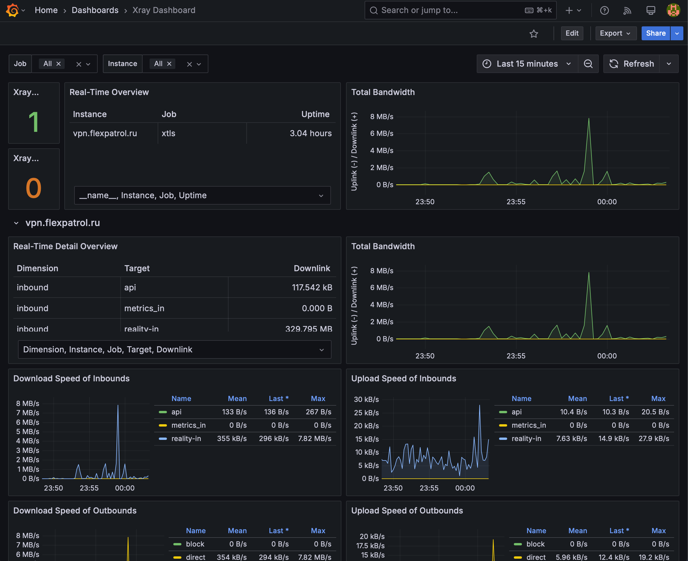
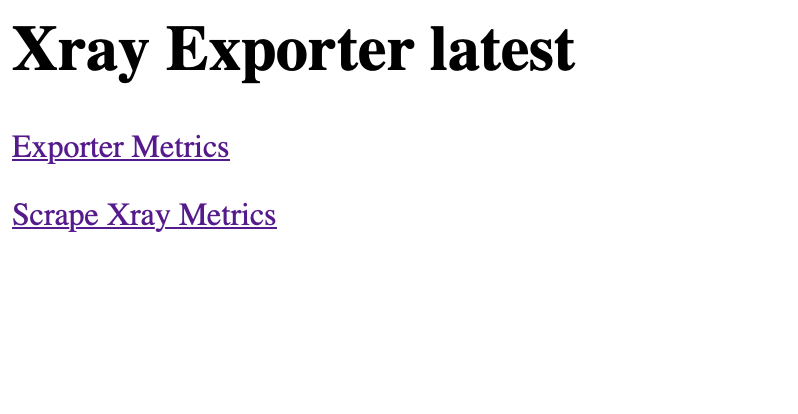

# Xray Exporter

An exporter that collects Xray metrics over its [Stats API](https://xtls.github.io/en/config/stats.html) and exports them to Prometheus.



## Quick Start

### Binaries

The latest binaries are made available on the [releases page](https://github.com/anatolykopyl/xray-exporter/releases):

```bash
wget -O /tmp/xray-exporter https://github.com/anatolykopyl/xray-exporter/releases/latest/download/xray-exporter_linux_amd64
mv /tmp/xray-exporter /usr/local/bin/xray-exporter
chmod +x /usr/local/bin/xray-exporter
```

### Docker

You can also find the docker images on [Docker Hub](https://hub.docker.com/r/anatolykopyl/xray-exporter). The images are made for multi-arch. You can run it from your Raspberry Pi or any other ARM, ARM64 devices without changing the image name:

```bash
docker run --rm anatolykopyl/xray-exporter:latest
```

### Grafana Dashboard

A simple Grafana dashboard is also available [here](./dashboard.json). Please refer to the [Grafana docs](https://grafana.com/docs/grafana/latest/reference/export_import/#importing-a-dashboard) to get the steps of importing dashboards from JSON files.

Also available on [grafana.com](https://grafana.com/grafana/dashboards/23145), but may not be the latest version, please consider downloading the dashboard JSON from the link above.

## Tutorial

Before we start, let's assume you have already set up Prometheus and Grafana.

Firstly, you will need to make sure the API and statistics related features have been enabled in your Xray config file. For example:

```json
{
    "stats": {},
    "api": {
        "tag": "api",
        "listen": "127.0.0.1:54321",
        "services": [
            "StatsService"
        ]
    },
    "inbounds": [
        {
            "tag": "tcp",
            "port": 12345,
            "protocol": "vmess",
            "settings": {
                "clients": [
                    {
                        "email": "foo@example.com",
                        "id": "e731f153-4f31-49d3-9e8f-ff8f396135ef",
                        "level": 0,
                        "alterId": 4
                    },
                    {
                        "email": "bar@example.com",
                        "id": "e731f153-4f31-49d3-9e8f-ff8f396135ee",
                        "level": 0,
                        "alterId": 4
                    }
                ]
            }
        }
    ],
    "outbounds": [
        {
            "protocol": "freedom",
            "tag": "direct"
        }
    ]
}
```

As you can see, we opened the API on port `:54321` in the configuration above, which is the endpoint that the exporter scrapes. 
If you'd like to run Xray and exporter on different machines, consider using `0.0.0.0` instead of `127.0.0.1` and be careful with the security risks.

Additionally, `stats` must be present in settings, even if empty. For more information, please visit [the Xray config reference](https://xtls.github.io/en/config/).

The next step is to start the exporter:

```bash
xray-exporter --xray-endpoint "127.0.0.1:54321"
## Or
docker run --network="host" --rm -d anatolykopyl/xray-exporter:latest --xray-endpoint "127.0.0.1:54321"
```

The network mode in Docker must be set to `host` if you are running Xray on the same machine. If you are running Xray also in a container, consider networking them via a bridge network.

The logs signifies that the exporter started to listening on the default address (`:9550`).

```
Xray Exporter latest-174e447 (built 2025-03-23T20:21:03Z)
time="2025-03-23T22:48:12Z" level=info msg="Server is ready to handle incoming scrape requests."
```

Use `--listen` option if you'd like to changing the listen address or port. You can now open `http://IP:9550` in your browser:



Click the `Scrape Xray Metrics` and the exporter will expose all metrics including Xray runtime and statistics data in the Prometheus metrics format, for example:

```
...
# HELP xray_up Indicate scrape succeeded or not
# TYPE xray_up gauge
xray_up 1
# HELP xray_uptime_seconds Xray uptime in seconds
# TYPE xray_uptime_seconds gauge
xray_uptime_seconds 150624
...
```

If `xray_up 1` doesn't exist in the response, that means the scrape was failed, please check out the logs (STDOUT or STDERR) of Xray Exporter for more detailed information.

We have the metrics exposed. Now let Prometheus scrapes these data points and visualize them with Grafana. Here is an example Promtheus configuration:

```yaml
global:
  scrape_interval: 15s
  scrape_timeout: 5s

scrape_configs:
  - job_name: xray
    metrics_path: /scrape
    static_configs:
      - targets: [IP:9550]
```

To learn more about Prometheus, please visit the [official docs](https://prometheus.io/docs/prometheus/latest/configuration/configuration/).

## Digging Deeper

The exporter doesn't retain the original metric names from Xray intentionally. You may find out why in the [comments](./exporter.go#L134).

For users who do not really care about the internal changes, but only need a mapping table, here it is:

| Runtime Metric   | Exposed Metric                     |
| :--------------- | :--------------------------------- |
| `uptime`         | `xray_uptime_seconds`             |
| `num_goroutine`  | `xray_goroutines`                 |
| `alloc`          | `xray_memstats_alloc_bytes`       |
| `total_alloc`    | `xray_memstats_alloc_bytes_total` |
| `sys`            | `xray_memstats_sys_bytes`         |
| `mallocs`        | `xray_memstats_mallocs_total`     |
| `frees`          | `xray_memstats_frees_total`       |
| `num_gc`         | `xray_memstats_num_gc`            |
| `pause_total_ns` | `xray_memstats_pause_total_ns`    |

| Statistic Metric                          | Exposed Metric                                                              |
| :---------------------------------------- | :-------------------------------------------------------------------------- |
| `inbound>>>tag-name>>>traffic>>>uplink`   | `xray_traffic_uplink_bytes_total{dimension="inbound",target="tag-name"}`   |
| `inbound>>>tag-name>>>traffic>>>downlink` | `xray_traffic_downlink_bytes_total{dimension="inbound",target="tag-name"}` |
| `outbound>>>tag-name>>>traffic>>>uplink`   | `xray_traffic_uplink_bytes_total{dimension="outbound",target="tag-name"}`   |
| `outbound>>>tag-name>>>traffic>>>downlink` | `xray_traffic_downlink_bytes_total{dimension="outbound",target="tag-name"}` |
| `user>>>user-email>>traffic>>>uplink`     | `xray_traffic_uplink_bytes_total{dimension="user",target="user-email"}`    |
| `user>>>user-email>>>traffic>>>downlink`  | `xray_traffic_downlink_bytes_total{dimension="user",target="user-email"}`  |
| ...                                       | ...                                                                         |

- The value of `live_objects` can be calculated by `memstats_mallocs_total - memstats_frees_total`.

## Special Thanks

- <https://github.com/schweikert/fping-exporter>
- <https://github.com/oliver006/redis_exporter>
- <https://github.com/roboll/helmfile>

